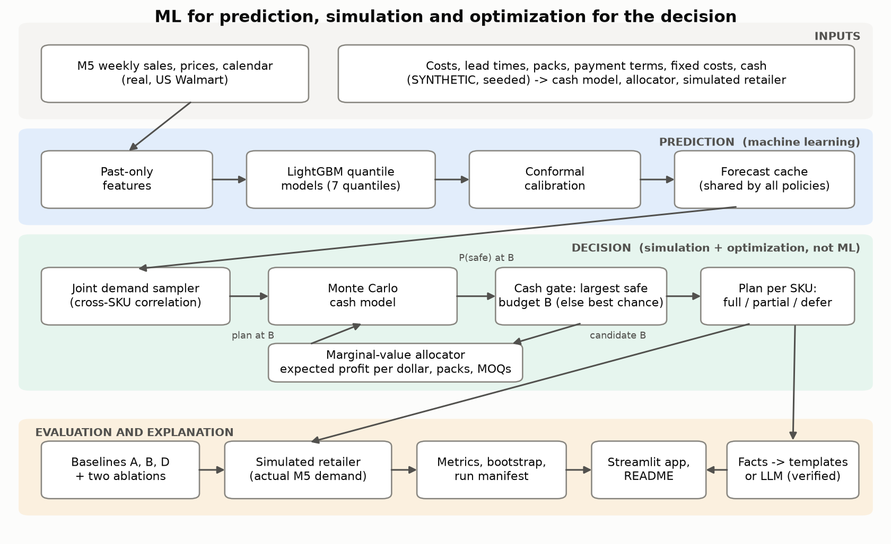
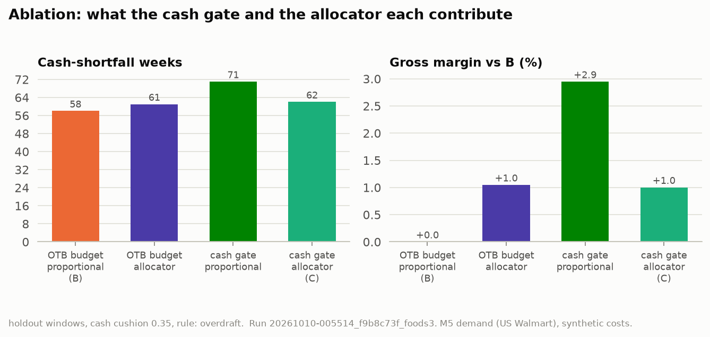
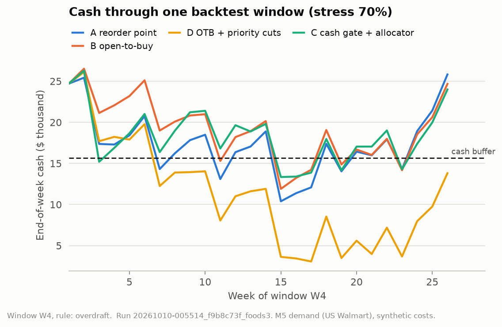
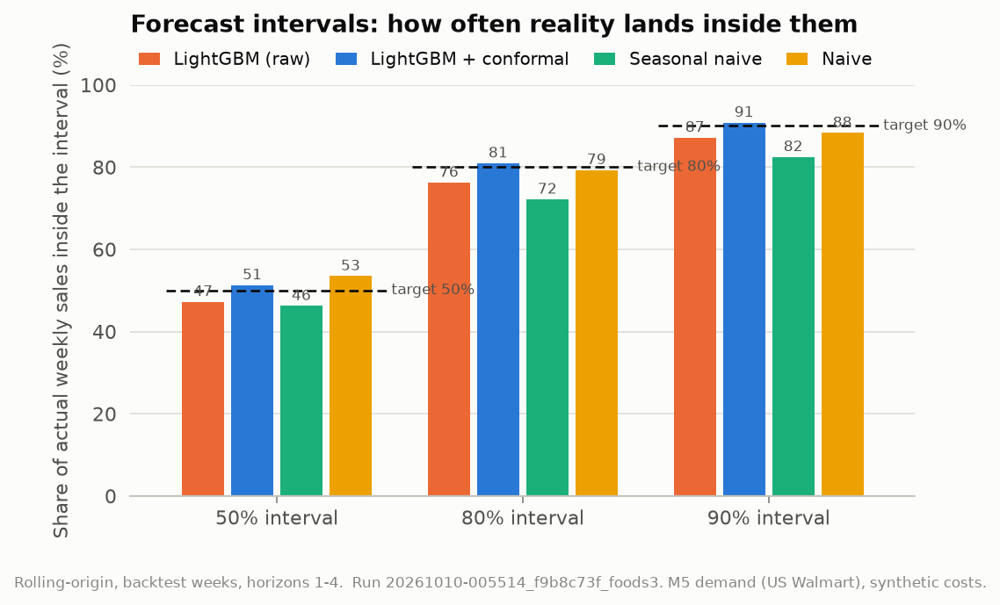
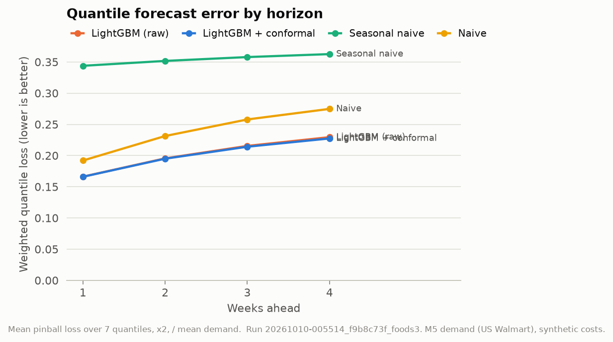
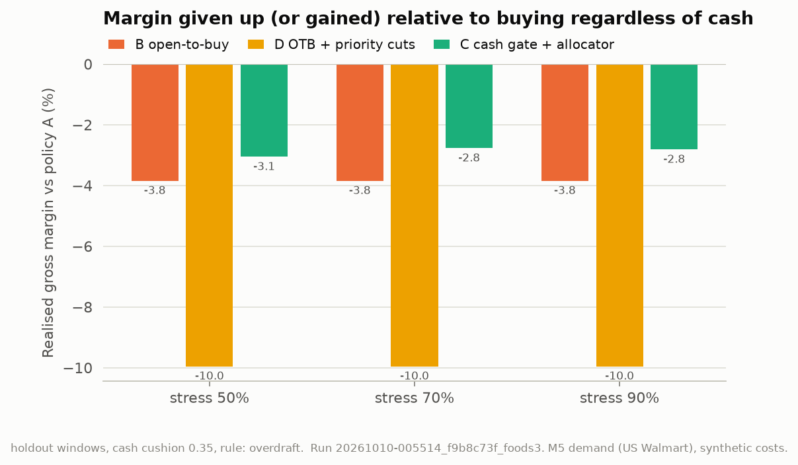
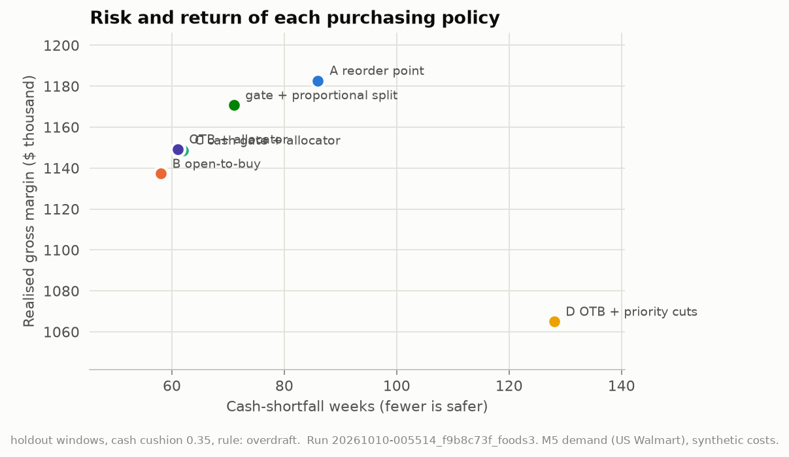
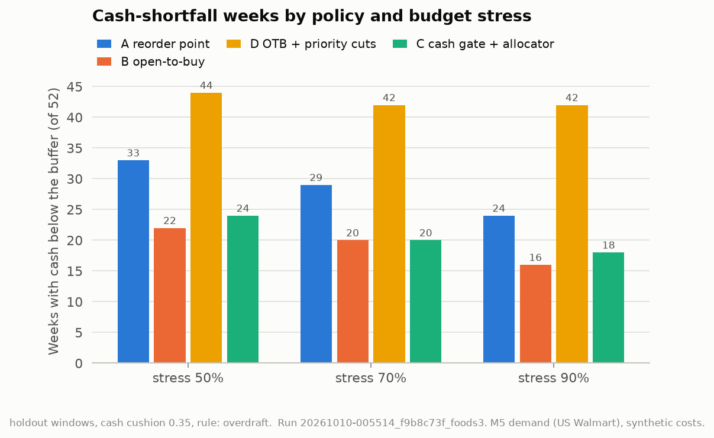

# <!-- BEGIN:project_name -->SafeToBuy<!-- END:project_name -->

**Open-to-buy gives you a budget. We tell you whether you can afford it, and how to spend it best.**

A purchasing assistant for small retailers. It forecasts demand with calibrated uncertainty,
projects the shop's cash over the coming weeks, finds the largest purchasing budget that keeps
the chance of a cash shortfall within a stated tolerance, spends that budget where expected
profit per dollar is highest, and explains every buy, partial buy and deferral.

ForgeHacks 2026, theme "AI for Real World Problems", track AI + Business.

<!-- BEGIN:headline -->
> **Policy C had 27.9% fewer cash-shortfall weeks than policy A (62 vs 86) (90% bootstrap interval for the reduction: +18.4% to +42.4%), and 1.0% higher margin than policy B (90% bootstrap interval for the difference: +0.6% to +1.7%), but more shortfall weeks than B (62 vs 58). Against policy A, C's margin was 2.9% lower. The planned headline form is not supported by this run, so the result is stated as it happened.**
>
> Scope: holdout windows, stress sweep, overdraft; 6 scenarios, 156 simulated weeks. Run `20261010-005514_f9b8c73f_foods3`.
<!-- END:headline -->

Every number in the Results section is written by `scripts/render_results.py` from a run
manifest. None is typed by hand.

---

## Problem

Small retailers fail from cash crunches, not only from slow sales. Inventory tools recommend
reorder quantities one product at a time, so the recommendations for a week can add up to more
than the shop can pay for. The owner is then left to cut the list by gut feel, at exactly the
moment a wrong cut costs the most: under-buy the fast sellers and revenue drops; buy everything
and the rent cheque bounces.

## Target users

Small retailers, convenience stores and independent e-commerce sellers who need purchasing
guidance without the complexity of enterprise planning software. The demo persona is a small
Singapore minimart. That persona is framing only: the demand data is US Walmart data and the
costs are synthetic (see [Data sources](#data-sources-attribution-and-licence) and
[Synthetic data disclosure](#synthetic-data-disclosure)).

## Illustrative scenario

This is an illustration of the mechanism, not an output of the system.

A shop's replenishment list for the week comes to $3,000, but only $2,000 can be spent without
putting next month's rent at risk. A per-product tool stops at the $3,000 list. This system:

1. **Says how much is safe.** It simulates the next four weeks of sales, supplier bills and fixed costs many times and reports the largest budget that keeps cash above the shop's buffer with the confidence the owner asked for. That is where the $2,000 comes from.
2. **Prioritises.** It ranks every unit on the list by expected profit per dollar: margin if it sells before the next delivery, a small carrying cost if it does not. Units of fast, high-margin products that are nearly sure to sell are funded first. The fifth pack of a slow product comes last.
3. **Defers the rest and prices the deferral.** For each product that is trimmed or skipped it shows the chance of running out before the next delivery and the expected margin lost by waiting a week.
4. **Explains in plain language**, one line per product.

## Approach and architecture



Mermaid source and the weekly loop: [docs/architecture.md](docs/architecture.md).

| Step | What it does | Where |
| --- | --- | --- |
| 1. Forecast | LightGBM quantile regression, one pooled model per quantile (5% to 95%), rolling conformal calibration of the intervals. Features use only data up to the forecast origin. | `src/cspa/forecast/`, `src/cspa/data/features.py` |
| 2. Sample | Joint demand paths for all SKUs by bootstrapping whole past weeks of forecast errors, so SKUs that were surprised together stay together. | `src/cspa/forecast/sampling.py` |
| 3. Project cash | Monte Carlo cash recursion per path: `cash = cash + revenue - fixed costs - supplier payments`, with sales capped by stock, existing payables and pipeline, and the candidate plan. | `src/cspa/cash/simulate.py` |
| 4. Cash gate | Largest budget B with `P(min cash >= buffer) >= 1 - alpha`. Bisection with common random numbers, then a grid check because the search is not monotone. If no budget meets the target, the budget with the best chance is used and the plan is flagged. | `src/cspa/cash/gate.py` |
| 5. Allocate | Greedy by marginal expected profit per dollar: `Cu * P(D > x) - Co * P(D <= x)` per unit, in pack sizes, with MOQs. | `src/cspa/allocate/` |
| 6. Explain | Facts per SKU and week, then templates or an LLM whose numbers are verified in code. | `src/cspa/explain/` |
| 7. Prove | Closed-loop backtest on real weekly demand against reorder-point, open-to-buy and priority-cut policies, with ablations. | `src/cspa/sim/`, `src/cspa/policies/` |

Policies compared (all act in the same simulated world, on the same demand):

| Policy | Budget | Allocation |
| --- | --- | --- |
| A, reorder point | none: spends what the targets require | order up to forecast over lead time + review period + safety stock |
| B, open-to-buy | planned sales + planned markdowns + planned end-of-period stock - beginning stock - on order, at cost | split in proportion to A's order need |
| **C, proposed** | **cash gate** | **marginal profit per dollar** |
| D, priority cuts | open-to-buy | A's need funded in full, highest (stockout probability x margin) first |
| ablation | cash gate | proportional split |
| ablation | open-to-buy | marginal profit per dollar |

The open-to-buy form used is the standard retail one, planned sales + planned markdowns + planned
end-of-period inventory - beginning-of-period inventory, with on-order stock also subtracted, as
described by [Shopify](https://www.shopify.com/retail/open-to-buy-plans) and
[Inventory Planner](https://www.inventory-planner.com/buying-budgets-with-open-to-buy-tools/).
Here it is computed at cost and weekly; planned markdowns are zero because M5 has no markdown plan.

## Honest AI/ML characterization

**ML for prediction, simulation and optimization for the decision.**

- **Machine learning is used for prediction only:** LightGBM quantile forecasting with conformal calibration.
- **The decision is not ML.** The cash model is a Monte Carlo simulation. The budget search and the allocator are optimization (a constrained search and a greedy knapsack heuristic).
- **An LLM is used only to verbalize numbers** the system has already computed. It never produces a quantity, a budget or a probability. Code checks every number in its output against the supplied facts and falls back to a deterministic template on any mismatch. The app works with no API key.

This is not "an ML system" end to end, and nothing here should be read that way.

## How to run

### The app only (no data needed)

The repo includes a small results bundle, so the app runs straight from a clone:

```bash
python3.11 -m venv .venv && source .venv/bin/activate
pip install -r app/requirements.txt
streamlit run app/streamlit_app.py
```

To deploy on Streamlit Community Cloud: new app from this repo, branch `main`, main file
`app/streamlit_app.py`, Python 3.11 under Advanced settings. `app/requirements.txt` is picked up
automatically. `ANTHROPIC_API_KEY` is an optional secret; without it explanations use templates.

### The full pipeline

Requirements: Python 3.11, about 400 MB of disk for the M5 files, macOS or Linux.

**1. Get the M5 data** (Kaggle login required; the raw files are not in this repo):

1. Open <https://www.kaggle.com/competitions/m5-forecasting-accuracy/data>, sign in and accept the competition rules.
2. Download `sales_train_evaluation.csv`, `sell_prices.csv` and `calendar.csv` (or the full zip) and put the three CSVs in `data/raw/`.

With the Kaggle CLI: `kaggle competitions download -c m5-forecasting-accuracy -p data/raw && unzip data/raw/m5-forecasting-accuracy.zip -d data/raw`.
If the files are missing, `make data` stops and prints these steps. It never fabricates data.

**2. Install and run:**

```bash
make setup                                # Python 3.11 venv in .venv (uv if installed, else python3.11); make uses it automatically
make test                                 # test-suite, runs on a synthetic fixture (no M5 needed)
make data                                 # slice, weekly aggregation, synthetic parameters
make forecast                             # rolling-origin quantile forecasts + evaluation (about 6 minutes)
make calibrate                            # tuning windows only: do the stress scenarios bind for policy A?
make tune                                 # every policy on tuning windows only (never touches holdout)
make sweep SET="--set risk.alpha=0.05,0.10"   # sensitivity on tuning windows only
make backtest                             # full backtest incl. held-out windows -> results/<run_id>/
make figures                              # PNG figures for the run
make render                               # fill the result blocks in this README and docs/
make screenshots                          # app screenshots -> docs/screenshots/ (headless Chrome)
make app                                  # Streamlit app
```

`make all` runs data, forecast, backtest, figures and render in order. The comparison slice uses
the same targets with `CONFIG=configs/household_1.yaml`.

macOS note: LightGBM needs an OpenMP runtime. The Makefile uses the copy bundled with
scikit-learn, so no Homebrew is needed; `brew install libomp` also works. Linux needs nothing extra.

**3. Optional, AI-worded explanations:** `export ANTHROPIC_API_KEY=...` before `make app` and tick
"AI-worded explanations" under Advanced. Model and effort are in `configs/default.yaml -> llm`.

Repository layout:

```
configs/        default.yaml (slice, horizons, synthetic params, risk, MC, seeds), experiments.yaml, household_1.yaml
src/cspa/       data/  forecast/  cash/  allocate/  policies/  sim/  explain/  config.py
scripts/        prepare_data, train_forecast, calibrate_scenarios, tune_sweep, run_backtest, make_figures,
                render_results, capture_screenshots, make_architecture
app/            streamlit_app.py, requirements.txt (lean, for deployment)
tests/          pytest suite + tests/fixtures/synthetic_m5_fixture.py (unit tests only)
docs/           ASSUMPTIONS.md, architecture.md, project_description.md, demo_script.md, tuning/, screenshots/
results/        <run_id>/ : manifest.json, metrics, headline.json, figures/, app/ bundle;  LATEST, SECONDARY
```

## Data sources, attribution and licence

- **Real data:** the [M5 Forecasting - Accuracy](https://www.kaggle.com/competitions/m5-forecasting-accuracy) competition dataset on Kaggle: Walmart unit sales, sell prices and calendar, made available by Walmart and the Makridakis Open Forecasting Center (MOFC) at the University of Nicosia. Reference: Makridakis, Spiliotis and Assimakopoulos, "M5 accuracy competition: Results, findings, and conclusions", International Journal of Forecasting 38(4), 2022.
- **What this repo contains:** no raw M5 files (`data/raw/` is gitignored). The results bundle under `results/<run_id>/app/` holds derived weekly aggregates for one store and one 300-SKU slice per run, plus forecasts and simulation results, which is what the app needs to run.
- **Licence note:** the M5 data remains subject to the terms on the Kaggle competition page; anyone reusing the bundled aggregates should credit the M5 competition as above. The code in this repository is the team's own.
- **Slice, history, windows, seed, commit:** see [Run details](#run-details), generated from the run manifest.
- **Synthetic:** everything about money other than shelf prices. See the next section.

## Synthetic data disclosure

M5 contains no costs, lead times, supplier terms or cash positions. All of the following are
**synthetic**, generated from `configs/default.yaml` with a fixed seed, and documented one by one
in [docs/ASSUMPTIONS.md](docs/ASSUMPTIONS.md).

<!-- BEGIN:synthetic_params -->
| Parameter | Value | Config key |
| --- | --- | --- |
| Unit cost | reference price x (1 - margin), margin ~ U(22%, 40%) per SKU; reference price = median M5 sell price in the selection window | synthetic.margin_range |
| Lead time | 1 wk (60%), 2 wk (40%) | synthetic.lead_time_weeks |
| Pack size | one of [1, 6, 12, 24] units, never more than 50% of a SKU's mean weekly units | synthetic.pack_sizes |
| MOQ | 1 pack(s) (70%), 2 pack(s) (30%) | synthetic.moq_packs |
| Supplier payment terms | S1_pay_on_delivery 60% of SKUs, pays 0 wk after delivery; S2_net7 40% of SKUs, pays 1 wk after delivery | synthetic.suppliers |
| Perishable SKUs | 20% of SKUs; 10% of leftover stock written off per week at 20% of cost | synthetic.perishable_share, spoilage_rate_per_week, salvage_frac_of_cost |
| Holding + capital cost | 20% + 15% of unit cost per year (decision parameter, not a simulated cash flow) | synthetic.holding_rate_annual, capital_rate_annual |
| Fixed costs | 95% of pre-window gross margin on average; part is paid as a lump every 4 weeks, sized by the stress level | synthetic.fixed_cost_* |
| Opening cash | buffer + cushion x s x R*, where s is the stress level and R* the ideal weekly replenishment cost; cushion is set per scenario | experiments.cash_cushions |
| Cash buffer | 2 weeks of average fixed costs | risk.buffer_weeks_of_fixed_costs |
| Opening stock, pipeline, payables | whatever policy A leaves after a 8-week burn-in with ample cash | synthetic.burn_in_weeks |
| Seed | 20261009 | seed |
<!-- END:synthetic_params -->

Consequences:

- **Dollar figures are illustrative.** Only demand patterns and shelf prices are real.
- **The meaningful result is the relative comparison between policies** in the same simulated world, on the same demand, with the same parameters.
- The Singapore minimart persona is framing. Nothing here is calibrated to Singapore costs, wages, rents or supplier terms.

## Results

### Headline

<!-- BEGIN:headline -->
> **Policy C had 27.9% fewer cash-shortfall weeks than policy A (62 vs 86) (90% bootstrap interval for the reduction: +18.4% to +42.4%), and 1.0% higher margin than policy B (90% bootstrap interval for the difference: +0.6% to +1.7%), but more shortfall weeks than B (62 vs 58). Against policy A, C's margin was 2.9% lower. The planned headline form is not supported by this run, so the result is stated as it happened.**
>
> Scope: holdout windows, stress sweep, overdraft; 6 scenarios, 156 simulated weeks. Run `20261010-005514_f9b8c73f_foods3`.
<!-- END:headline -->

The headline is computed on **held-out windows only** (never used to choose settings), over the
three budget-stress levels. The planned wording ("X% fewer cash shortfalls than policy A, and Y%
higher margin than policy B at equal or lower risk") is used only if every part holds and both
differences have bootstrap intervals clear of zero. Otherwise the generated sentence says what
happened.

### What the held-out data supports, and what it does not

<!-- BEGIN:verdict -->
**Headline scope** (holdout windows, the three stress levels, rule `overdraft`, 156 simulated weeks per policy):

- **Fewer cash-shortfall weeks than A: supported.** C 62 vs A 86 of 156 weeks, 27.9% fewer (90% interval +18.4% to +42.4%).
- **Higher margin than B: supported.** 1.0% higher (90% interval +0.6% to +1.7%).
- **No more shortfall weeks than B: does not hold.** C 62 vs B 58 (C had no more than B in only 11% of bootstrap resamples).
- **Cost against A:** C's gross margin was 2.9% lower than A's.
- **Weeks with cash below zero:** A 0, B 2, C 0.
- **Planned headline form:** not supported. It needs fewer shortfall weeks than A, higher margin than B, both with intervals clear of zero, and no more shortfall weeks than B.

**Same windows under the alternative cash rule `cut_proportional`:**

- **Fewer cash-shortfall weeks than A: not supported.** C 65 vs A 68 of 156 weeks, 4.4% fewer (90% interval -9.0% to +24.2%; the interval includes zero).
- **Higher margin than B: supported.** 4.2% higher (90% interval +2.0% to +8.9%).
- **No more shortfall weeks than B: does not hold.** C 65 vs B 60 (C had no more than B in only 3% of bootstrap resamples).
- **Cost against A:** C's gross margin was 6.4% lower than A's.
- **Weeks with cash below zero:** A 16, B 23, C 18.

**It is not uniform across the held-out data.** window W3: shortfall weeks A 64 / B 42 / C 44, margin vs B +2.9% (90% interval +2.2% to +3.9%), planned form does not hold; window W4: shortfall weeks A 22 / B 16 / C 18, margin vs B -0.9% (90% interval -1.4% to -0.2%), planned form does not hold; stress 50%: shortfall weeks A 33 / B 22 / C 24, margin vs B +0.8% (90% interval +0.1% to +2.0%), planned form does not hold; stress 70%: shortfall weeks A 29 / B 20 / C 20, margin vs B +1.1% (90% interval +0.4% to +2.3%), planned form holds; stress 90%: shortfall weeks A 24 / B 16 / C 18, margin vs B +1.1% (90% interval +0.3% to +2.2%), planned form does not hold. These cuts were not chosen in advance and none of them is the headline.

**Tune windows (used to choose settings, so optimistic by construction):** shortfall weeks A 51 / B 30 / C 34, margin vs B +0.5% (90% interval -0.0% to +0.7%), vs A -2.7%.
<!-- END:verdict -->

### All policies, headline scope

<!-- BEGIN:results_table -->
| Policy | Shortfall weeks | Insolvency weeks | Fill rate | Gross margin | Lost margin (stockouts) | Ending net position (mean) | Days of inventory |
| --- | ---: | ---: | ---: | ---: | ---: | ---: | ---: |
| A: reorder point | 86 / 156 | 0 | 96.9% | $1,182,702 | $33,092 | $28,650 | 9.9 |
| B: open-to-buy, proportional split | 58 / 156 | 2 | 92.2% | $1,137,235 | $92,920 | $21,072 | 7.2 |
| D: open-to-buy, priority cuts | 128 / 156 | 36 | 76.2% | $1,064,980 | $155,768 | $9,029 | 9.6 |
| **C: cash gate + marginal allocator (proposed)** | 62 / 156 | 0 | 92.8% | $1,148,634 | $81,423 | $22,972 | 8.0 |
| ablation: cash gate + proportional split | 71 / 156 | 1 | 95.6% | $1,170,756 | $49,818 | $26,659 | 8.9 |
| ablation: OTB budget + marginal allocator | 61 / 156 | 0 | 92.7% | $1,149,146 | $81,287 | $23,057 | 7.8 |
<!-- END:results_table -->

Shortfall week = a week ending with cash below the buffer. Insolvency week = cash below zero.
Net position = cash + stock at cost + pipeline at cost - payables. Lost margin = unit margin on
demand that met an empty shelf.

### By budget stress

Budget stress s tightens two things. In the heaviest fixed-cost week of each four-week cycle,
expected revenue minus fixed costs covers only s of the ideal weekly replenishment spend R*; and
the shop opens with free cash above its buffer of only `cushion x s x R*`. Lower is tighter.

<!-- BEGIN:stress_table -->
| Budget stress | A shortfall wks | B shortfall wks | D shortfall wks | C shortfall wks | A margin | B margin | D margin | C margin |
| --- | ---: | ---: | ---: | ---: | ---: | ---: | ---: | ---: |
| 50% | 33 | 22 | 44 | 24 | $394,234 | $379,078 | $354,993 | $382,188 |
| 70% | 29 | 20 | 42 | 20 | $394,234 | $379,078 | $354,993 | $383,306 |
| 90% | 24 | 16 | 42 | 18 | $394,234 | $379,078 | $354,993 | $383,140 |
<!-- END:stress_table -->

### By opening cash

<!-- BEGIN:start_cash_table -->
| Opening free cash (x stress x R*) | A shortfall wks | B shortfall wks | D shortfall wks | C shortfall wks | A margin | B margin | D margin | C margin |
| --- | ---: | ---: | ---: | ---: | ---: | ---: | ---: | ---: |
| 0.2 | 38 | 24 | 44 | 27 | $394,234 | $379,078 | $354,993 | $383,548 |
| 0.35 | 29 | 20 | 42 | 20 | $394,234 | $379,078 | $354,993 | $383,306 |
| 0.75 | 12 | 11 | 32 | 12 | $394,234 | $379,078 | $354,993 | $381,107 |
<!-- END:start_cash_table -->

### Robustness of the headline

The same comparison under the alternative cash-shortfall rule, on the tuning windows, per window
and per stress level.

<!-- BEGIN:robustness_table -->
| Scope | Shortfall weeks A / B / C | X: fewer shortfalls than A | X 90% interval | Y: margin vs B | Y 90% interval | Risk <= B | Planned headline form holds |
| --- | ---: | ---: | ---: | ---: | ---: | ---: | ---: |
| Headline: holdout windows, rule overdraft | 86 / 58 / 62 | +27.9% | +18.4% to +42.4% | +1.0% | +0.6% to +1.7% | no | no |
| holdout windows, rule cut_proportional | 68 / 60 / 65 | +4.4% | -9.0% to +24.2% | +4.2% | +2.0% to +8.9% | no | no |
| tune windows (used for tuning), rule overdraft | 51 / 30 / 34 | +33.3% | +20.0% to +55.6% | +0.5% | -0.0% to +0.7% | no | no |
| Window W3 only | 64 / 42 / 44 | +31.2% | +19.0% to +50.0% | +2.9% | +2.2% to +3.9% | no | no |
| Window W4 only | 22 / 16 / 18 | +18.2% | +0.0% to +40.9% | -0.9% | -1.4% to -0.2% | no | no |
| Stress 50% only | 33 / 22 / 24 | +27.3% | +13.5% to +46.9% | +0.8% | +0.1% to +2.0% | no | no |
| Stress 70% only | 29 / 20 / 20 | +31.0% | +12.5% to +56.5% | +1.1% | +0.4% to +2.3% | yes | yes |
| Stress 90% only | 24 / 16 / 18 | +25.0% | +0.0% to +56.0% | +1.1% | +0.3% to +2.2% | no | no |
<!-- END:robustness_table -->

### Comparison slice

<!-- BEGIN:secondary_slice -->
**Store CA_1, department HOUSEHOLD_1** (300 of 532 SKUs), same settings as the primary slice with nothing retuned. Run `20261010-005551_e25dab98_household1`, config hash `e25dab98faa9`.

- **Fewer cash-shortfall weeks than A: not informative.** A ran short in only 3 of 156 weeks (C: 0), too few to support a claim.
- **Higher margin than B: supported.** 1.4% higher (90% interval +1.3% to +1.7%).
- **No more shortfall weeks than B: holds.** C 0 vs B 0 (C had no more than B in 100% of bootstrap resamples).
- **Cost against A:** C's gross margin was 0.1% higher than A's.
- **Weeks with cash below zero:** A 0, B 0, C 0.

On this slice the held-out windows were comfortable: policy A ran short in only 3 of 156 weeks, so it says little about cash shortfalls. What it does show is the margin comparison. The planned headline form holds formally here, but only on that handful of weeks, so we do not lead with it.

| Policy | Shortfall weeks | Insolvency weeks | Fill rate | Gross margin | Lost margin (stockouts) | Ending net position (mean) | Days of inventory |
| --- | ---: | ---: | ---: | ---: | ---: | ---: | ---: |
| A: reorder point | 3 / 156 | 0 | 97.9% | $684,624 | $14,705 | $26,843 | 8.7 |
| B: open-to-buy, proportional split | 0 / 156 | 0 | 95.2% | $675,452 | $30,883 | $25,315 | 6.8 |
| D: open-to-buy, priority cuts | 24 / 156 | 0 | 78.8% | $647,923 | $53,859 | $20,727 | 8.5 |
| **C: cash gate + marginal allocator (proposed)** | 0 / 156 | 0 | 96.9% | $685,213 | $21,997 | $26,942 | 10.5 |
| ablation: cash gate + proportional split | 0 / 156 | 0 | 97.2% | $681,751 | $18,645 | $26,365 | 8.4 |
| ablation: OTB budget + marginal allocator | 0 / 156 | 0 | 96.0% | $679,867 | $29,140 | $26,051 | 7.5 |
<!-- END:secondary_slice -->

### Forecast quality

<!-- BEGIN:forecast_table -->
| Forecaster | wQL (lower is better) | Mean pinball (units) | 50% interval coverage | 80% interval coverage | 90% interval coverage |
| --- | ---: | ---: | ---: | ---: | ---: |
| LightGBM quantile (raw) | 0.201 | 3.75 | 47.2% | 76.2% | 87.2% |
| LightGBM quantile + conformal | 0.200 | 3.73 | 51.3% | 80.9% | 90.8% |
| Seasonal naive | 0.354 | 6.59 | 46.2% | 72.1% | 82.5% |
| Naive | 0.239 | 4.44 | 53.5% | 79.3% | 88.3% |

Rolling-origin over the backtest decision weeks, horizons 1 to 4, 123,000 SKU-week-horizon cells per model. LightGBM refit every 4 weeks, predicted weekly.
<!-- END:forecast_table -->

wQL is twice the mean pinball loss over the seven quantiles divided by mean demand. Coverage is
the share of realised weekly sales inside each central interval; the targets are 50%, 80%, 90%.

### Figures

<!-- BEGIN:figures -->







<!-- END:figures -->

### Run details

<!-- BEGIN:run_info -->
| Item | Value |
| --- | --- |
| Run id | `20261010-005514_f9b8c73f_foods3` |
| Timestamp (UTC) | 2026-10-09T16:55:51Z |
| Git commit | `85dd358ada3699155c0156fb3254b2e9f9e8820e` |
| Config hash | `f9b8c73fa808` |
| Seed | 20261009 |
| Data slice | store CA_1, department FOODS_3, 300 of 823 SKUs (84% of department units in the selection window) |
| History | 277 complete Walmart weeks, 2011-01-29 to 2016-05-20 |
| SKU selection window | weeks 113 to 164 (pre_backtest) |
| Backtest windows | W1 (tune): weeks 173 to 198; W2 (tune): weeks 199 to 224; W3 (holdout): weeks 225 to 250; W4 (holdout): weeks 251 to 276 |
| Scenarios x policies | 40 x 6 |
| Monte Carlo paths per decision | 500 (block sampling) |
| Forecaster | lgbm, refit every 4 weeks, conformal: True |
| Policy fairness check | passed |
<!-- END:run_info -->

## How the settings were chosen

Four consecutive 26-week windows end at the end of the M5 history. The first two were used to
choose every setting; the last two were simulated once, after the settings were frozen, and are
the only source of the headline. The console output of each tuning-window comparison is saved in
[docs/tuning/](docs/tuning/), and [docs/ASSUMPTIONS.md](docs/ASSUMPTIONS.md) section 8 says what
changed and why. In short:

- **Scenarios** were recalibrated until the reorder-point policy really ran short of cash at the 50% and 70% stress levels (`01_scenario_calibration_*.txt`).
- **The cash gate's fallback.** When no budget meets the target, policy C takes the budget with the best chance of staying above the buffer instead of buying nothing (`04_infeasible_rule.txt`).
- **The cash projection** assumes later weeks replace what was sold, but never by spending below the buffer (`02_gate_projection_and_tiebreak.txt`).
- **Risk tolerance, capital charge and ranking rule** were swept and left at their starting values because nothing else did better (`03_alpha_capital_ranking.txt`).

## Tests

`make test` runs on a small synthetic fixture and covers:

- **No lookahead:** all sales and prices after a cutoff are replaced by noise (and, separately, deleted); features, forecasts, conformal calibration, sampled demand and every policy's order must be byte-identical. The conformal window must end before the cutoff.
- **Allocator feasibility:** spend never exceeds the budget; whole units, whole packs, MOQs respected; nothing with non-positive marginal value is funded.
- **Allocator optimality:** greedy equals brute force on tiny instances with equal unit costs, and is within one unit's value otherwise.
- **Cash conservation:** every week, cash change equals revenue minus payments minus fixed costs, and stock change equals arrivals minus sales (minus write-offs for perishables).
- **Gate correctness:** the returned budget satisfies the probability constraint on the same random numbers; when no budget does, the result is flagged and is the best of everything evaluated.
- **LLM guardrail:** a response with an altered number is rejected and the template is used.
- **Policy fairness:** every policy receives identical demand realisations and parameters.
- **Reproducibility:** a fixed seed gives identical results, including bootstrap intervals.
- **Honest headline:** the planned wording is only produced when every part holds with intervals clear of zero.

## Limitations

- **Synthetic costs, lead times, payment terms, fixed costs and cash.** Dollar results are illustrative. Different synthetic parameters would give different dollar figures and could change the ranking of policies.
- **The stress scenarios were built to be tight.** Opening cash and the monthly lump of fixed costs were set, on tuning windows, so that buying regardless of cash runs short. In comfortable scenarios the policies differ much less (see the comparison slice).
- **US data, Singapore persona.** M5 is Walmart data from California. The minimart persona is framing only.
- **M5 sales are censored and intermittent.** Recorded sales are capped by Walmart's own stockouts, so true demand is sometimes higher than what the forecaster learns from and what the backtest replays. Many SKU-weeks are zero. The slice is a set of high-volume items chosen before the backtest period.
- **Correlation handling.** Cross-SKU dependence comes from resampling whole past weeks of forecast errors (about a year of them), mapped through each SKU's predicted quantiles. This assumes the near future co-moves like the recent past, gives a coarse joint distribution, and extrapolates tails beyond the 95% quantile with a fitted exponential.
- **Cash projection assumption.** For weeks after the current order the projection assumes one-for-one replenishment that never spends below the buffer. That is a modelling choice, and the probabilities it produces are estimates, not guarantees.
- **The budget search is not monotone**, because stock bought now earns revenue. The gate checks a coarse grid after bisecting and keeps the largest feasible budget found; it does not guarantee the global maximum.
  <!-- BEGIN:gate_diagnostics -->
Across all 1040 policy-C decisions in this run, some budget met the target in 237 (the gate was binding in 237 of them). In the other 803 no budget did, not even zero: the result was flagged "cash at risk regardless of purchasing" and the best-chance budget was used. The coarse-grid check found 483 monotonicity violation(s) (grid points whose feasibility disagreed with the bisection).
<!-- END:gate_diagnostics -->
- **A risk tolerance is a tolerance.** With alpha = 10% the gate accepts up to a 10% chance of a shortfall at each decision, and in the stressed scenarios the target often could not be met at all. Policy C is expected to have shortfall weeks.
- **A chance constraint does not price what it gives up.** The gate protects the buffer; it does not weigh that against lost margin. Deferring stock that would have sold costs margin and, a few weeks later, cash.
- **The two halves do not simply add up.** Ablations on the headline scope:
  <!-- BEGIN:ablation_note -->
Swapping the proportional split for the marginal allocator: with an open-to-buy budget, gross margin +1.0%, shortfall weeks 58 to 61; with the cash gate, gross margin -1.9%, shortfall weeks 71 to 62. Swapping the open-to-buy budget for the cash gate: with a proportional split, gross margin +2.9%, shortfall weeks 58 to 71; with the marginal allocator, gross margin -0.0%, shortfall weeks 61 to 62.
<!-- END:ablation_note -->
  The allocator is a greedy heuristic for a knapsack problem with packs and MOQs, not an exact solver, and neither it nor the cash model is ML.
- **Baselines are simple.** Policy B's open-to-buy budget is used as a cap whose target stock matches policy A's, with no markdown plan. A retailer's real OTB process would be tuned to its own plan.
- **Supplier terms are short** (pay on delivery, net-7) so that every bill for this week's order falls inside the 4-week cash horizon.
- **Competitive coverage is partial.** See the next section.
- The LLM path was tested with a fake client only; no live API key was available during the build.

## Related tools and the difference

- Shopify inventory apps such as "Restock: Reorder Forecasting" and "SP | AI Inventory Management" already do per-product ML demand forecasting, reorder quantities, lead times, safety stock and purchase-order suggestions.
- Open-to-buy planning, offered in tools like Inventory Planner, sets a buying budget from a deterministic formula.
- **This project** derives the budget from a probabilistic cash-risk constraint and then allocates it by marginal profit per dollar, with explained deferrals.

We do not claim that no tool does budget allocation. Our competitive review covered only
Shopify-style apps and open-to-buy content, not enterprise planning software.

## More

- [docs/ASSUMPTIONS.md](docs/ASSUMPTIONS.md): every open choice, the value chosen, why, and how to change it; the tuning log.
- [docs/project_description.md](docs/project_description.md): written project description.
- [docs/demo_script.md](docs/demo_script.md): demo script, under four minutes.
- [docs/devpost_submission.md](docs/devpost_submission.md): ready-to-paste submission text.
