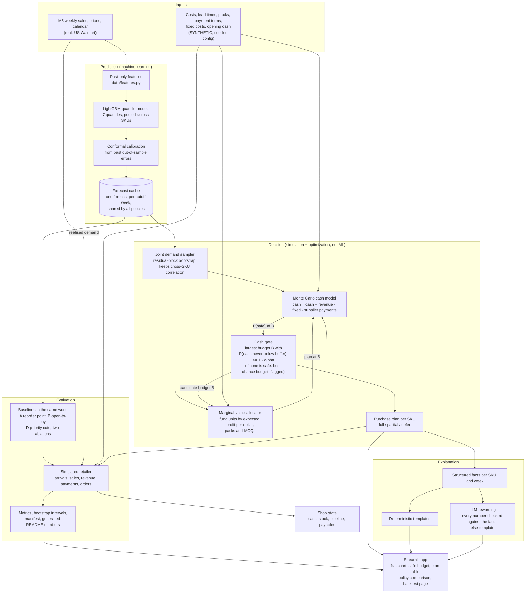

# Architecture

**ML for prediction, simulation and optimization for the decision.** The diagram marks which is which.

## The weekly loop

1. Forecast: read the cached quantile forecast for the cutoff week (last observed week).
2. Sample: draw joint demand paths for the next four weeks from the forecast and the bank of past forecast errors.
3. Gate: bisect on the budget B. Each candidate B runs the allocator, then the cash simulation on the same demand paths, and reads off P(cash never below the buffer). A coarse grid then checks the result, because buying stock that sells quickly can raise cash and break monotonicity. If no budget meets the target, the gate returns the one with the best chance and flags the plan.
4. Allocate: spend the safe budget on the units with the highest expected profit per dollar.
5. Explain: turn the plan into facts, then sentences.
6. In the backtest only: step the simulated shop with the actual M5 demand for that week and repeat.

A static copy of this diagram is at `docs/architecture.png` (`python scripts/make_architecture.py`).
